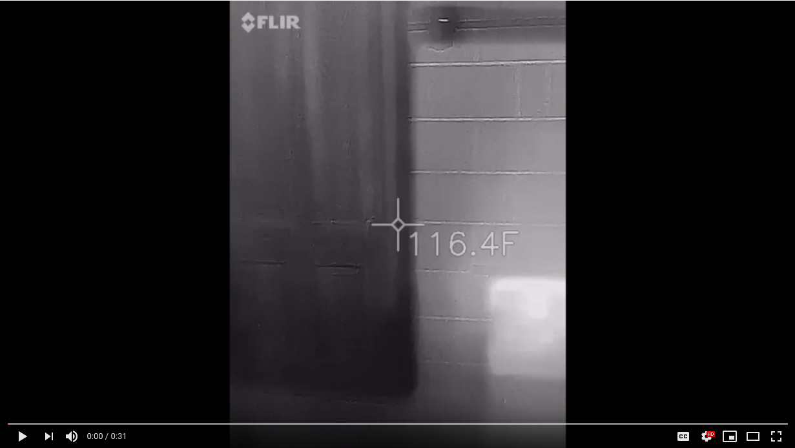

# SaunaModel.jl Guide

```@meta
CurrentModule = SaunaModel
```
Warming up with [Differential Equations](https://docs.juliadiffeq.org/latest/) and [Unitful](https://ajkeller34.github.io/Unitful.jl/stable/).

This package is estimate of how a lumped sum sauna would behave. A lumped sum system modeling means approximating each component of the system with one number. This is a rough and ready approximation: obviously, the stove isn't all one temperature, and the air has has a very complex fluid dynamics problem, which could heat a small sized sauna with the heat given off with all the computers needed to solve in granular detail.

You might ask why would I sink the time into modelling a sauna with differential equations. It sprung from a group chat where we were discussing the impact of adding a water tank to a sauna. I fired off some real preliminary calculations, then said I didn't have the time to write up the differential equations to do it right. The problem stuck with me, and I figured I had enough discussions abouth the thermal dynamics of a sauna to bump out a solution.

The current active usage of this package is [saunasim](https://saunasim.com), deployed by Mark Halonen

Development of the model relied on several discussions with Trent Johnson and Chet Daavetila.
## Video of Steam Throwing
To get a rough idea what steam throwing looks like thermally:
[](https://youtu.be/fQZfXllGo0s)

## Examples
```@contents
Pages = ["use/guide.md", "use/api.md"]
Depth = 2
```

## Commentary on development
I developed the model in Julia for a couple of reasons. First, it is my daily driver language, it is what I use all the time. It also offers some excellent unit and differential equations packages. I used a functional approach as far as possible, avoiding side effects other than what is dictated by the Differential Equations package. This should make the code base easier to maintain.
