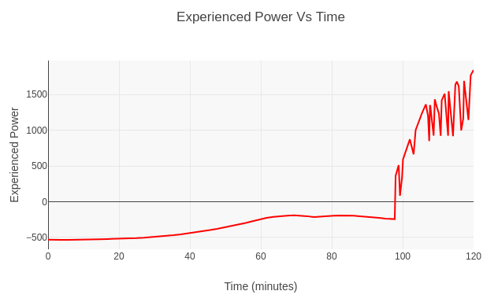
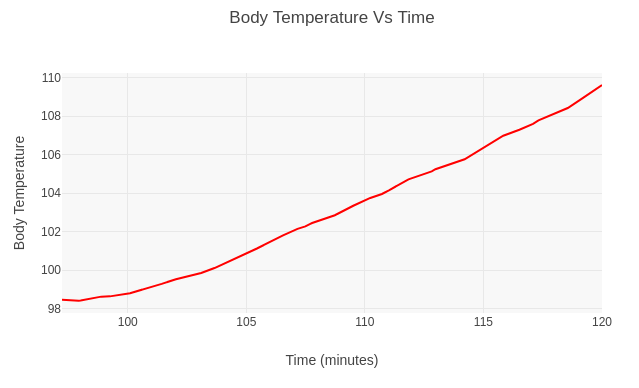

# Humans in the Sauna
Humans absorb and relase heat in a variety of ways in a sauna. First and foremost, convection from the air in the sauna. The hotter and wetter the air, and the more it is moving due to displaced steam, the hotter you will feel. You also exchange radiation with the room and stove. An oversized stove will bake your shins.

In order to get a handle on the problem, I relied heavily on the paper *The Assessment of Sultriness. Part I: A Temperature-Humidity Index Based on Human Physiology and Clothing Science -Steadman*. The paper defintely gave me something to work on with skin heat and moisture resistances at various temperatures. I am extrapolating from these points, but without that paper I would have been totally lost.

## Heat into humam
Heat into humans comes from multiple sources. One is radiation, from both the stove and the room. A view factor of the stove is estimated by dividing the apparent area of the stove by the external area of the room.
```@docs
heat_into_humans
```
An example output is displayed below, resulting from the default configuration. The spikes are due to sudden increases in the convection coefficient.

### Convection coefficient
Computing the convection coefficient was quite a bit more difficult than I originally expected. It is hard to do better than a thumb in the air estimate, but I tried to find tables with which to build a reasonable basis. The majority of the spike in power you feel when you throw steam is due to changes in the convection coefficient.
```@docs
compute_effective_convection_coeff
```
### Evaporative cooling
You sweat to cool off. A sauna limits the effectivness of this sweating by raising the partial pressure of water to the point that the sweat no longer evaporates at the same rate that you can produce it at. My estimates  in this part greatly relied on the Steadman paper.
```@docs
skin_moisture_resistance
surface_moisture_resistance
evaporation_cooling
```
## Results
I didn't include the human in the differential equations loop, as they are not a constant part of the scenario. A little more finagling could bring them in perhaps. As a jump, just once. This isn't a large problem because human's core body temperature cannot rise all that much before it becomes dangerous to remain in the sauna. Certainly the skin temperature can get quite a bit warmer than the core, but not incredibly so. Accurate to a rough order of magnitude at least.

I assumed an "average" body of about 150lbs with some other "reasonable" figures. Another way to increase accuracy would be to introduce a configureable human. The human temperature curve only starts when the human enters the sauna and starts throwing steam.

