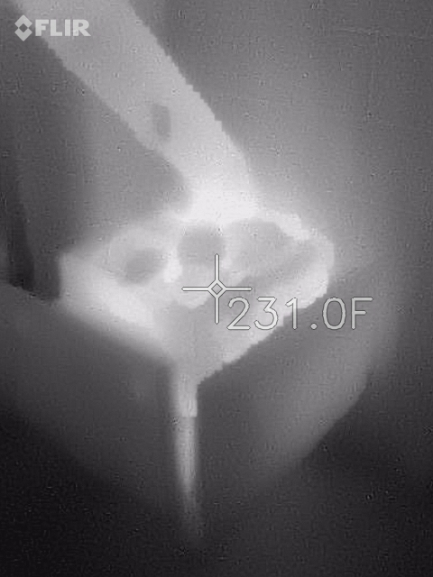
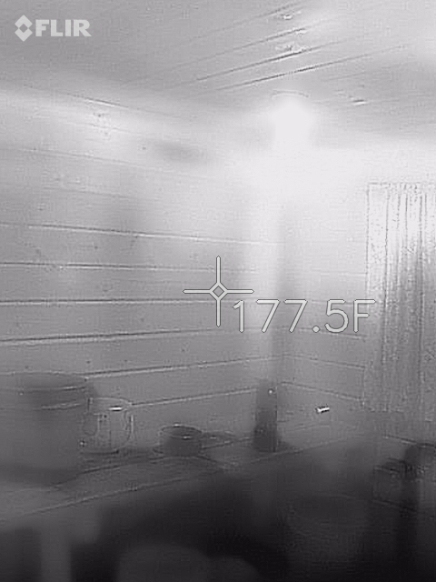

# Modelling the Sauna

## Components
Elements of the sauna include
- Fire
- Stove
- Air temperature
- Air humidity
- Walls and furniture of the room
- Floor of the sauna
- Air outside (both temperature and humidity)
- Mass of water on stove
- Temperature of water on stove

There are many other possible variables to consider, such as the effect of adding a water heater.
## Boundary Conditions
One way to make the system simpiler to deal with is to assume a constant value for some components of the system, and to drive some components with functions. In the default scenario:
- Floor of sauna is assumed to be 50 °F
- Outside temperature is assumed to be 50 °F
- Outside relative humidity is 30%
- The fire grows to a maximum temperature of 1000°F and a radius of .3 meters

## Some visualizations
The stove is very hot, with a large thermal mass, in the middle of the room.

The room itself, the wood inside it, also gathers a lot of heat. 

